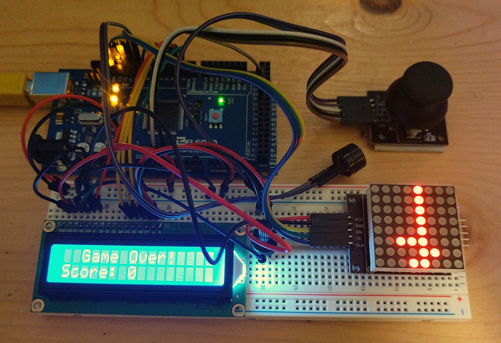

# Tetris... on an Arduino!

This is a simple project built using the Arduino Mega 2560. It features the game "Tetris" played on an 8x8 led display, with some game details on a 16x2 LCD display along with a joystick for controlling the game. I originally had 4 buttons controlling gameplay, but then decided to use a joystick since I had one laying around. There is also a buzzer which emits a tone every time a row is cleared.

This project took about a day to build, coding included. The project went through many iterations such as the addition of the 16x2 display and the replacement of the buttons with the joystick.

While at first it seemed that 64 squares was too limited of a space to play Tetris, the gameplay actually turned out to be "all right". You always have to be on your feet because you only have so much space to work with within the game. If I had another LED matrix display I would have connected it, but unfortunately I do not. Here's a video of the gameplay: [Youtube Video](https://www.youtube.com/watch?v=fBtme0Q1pJU)

**Parts:**
- 1x [Arduino Mega](https://store.arduino.cc/usa/mega-2560-r3)
- 1x [Passive Buzzer](https://www.amazon.com/Gikfun-Terminals-Passive-Electronic-Arduino/dp/B01GJLE5BS/ref=sr_1_3?dchild=1&keywords=passive+buzzer&qid=1608431497&sr=8-3)
- 1x [16x2 LCD Display](https://www.amazon.com/HiLetgo-Display-Backlight-Controller-Character/dp/B00HJ6AFW6/ref=sr_1_2?dchild=1&keywords=16x2+display&qid=1608431533&sr=8-2)
- 1x [8x8 LED Dot Matrix](https://www.amazon.com/Organizer-MAX7219-Display-Single-Chip-Control/dp/B07VM6HXN5/ref=sr_1_3?dchild=1&keywords=8x8+dot+matrix&qid=1608431619&sr=8-3)
- 1x (Optional) [MAX7219 LED Controller (If your LED Matrix does not include one)](https://www.amazon.com/Artshu-MAX7219-package-MAX7219CNG-MAX7219ENG/dp/B07FW17ZW8/ref=sr_1_3?dchild=1&keywords=MAX7219&qid=1608431640&sr=8-3)
- 1x [2 axis joystick](https://www.amazon.com/HiLetgo-Controller-JoyStick-Breakout-Arduino/dp/B00P7QBGD2/ref=sr_1_4?dchild=1&keywords=2+axis+joystick&qid=1608431554&sr=8-4)
- [A bunch of wires and breadboard](https://www.amazon.com/Breadboard-Solderless-Prototype-Male-Female-Female-Female/dp/B073X7GZ1P/ref=sr_1_4?dchild=1&keywords=breadboard+with+wires&qid=1608431587&sr=8-4)

The code is actually pretty simple. It's in the repository, if you want to check it out.

I may also be releasing a step-by-step tutorial someday on my blog. Stay tuned if you're interested for that. (https://jaeheonshim.com)